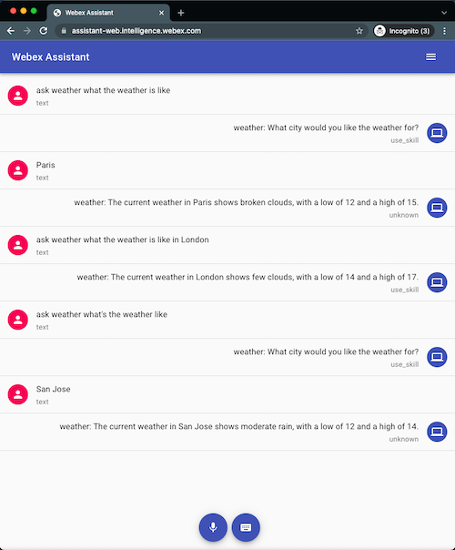

# Basic Amazon Lex Skill Example

The purpose of this example is to show the use of external NLP for identifying user intent in our skills.  In this
case we're using Amazon Lex to provide basic weather information for a given city using the OpenWeatherMap API.
In addition, we provide basic slot filling for the City name if one is not provided.

For the purposes of this example, it is assumed that you have run through the `echo-skill-secure` example and 
already have the `public.pem`, `private.pem` and `secret.txt` files and have configured the skill on the skills service.

In addition, you will require the following environment variables:

* `OPENWEATHERMAP_API` - API Key for openWeatherMap.org
* `AWS_REGION` - AWS Region, e.g. 
* `AWS_ACCESS_KEY_ID` - AWS Access Key ID with access to Lex
* `AWS_SECRET_ACCESS_KEY` - AWS Secret Access Key with access to Lex
* `LEX_ALIAS` - The published LEX Alias
* `LEX_BOTNAME` - The published LEX Bot Name

You can import the basic weather bot to Amazon Lex using the [`WeatherBot_Export.json` file](./WeatherBot_Export.json)